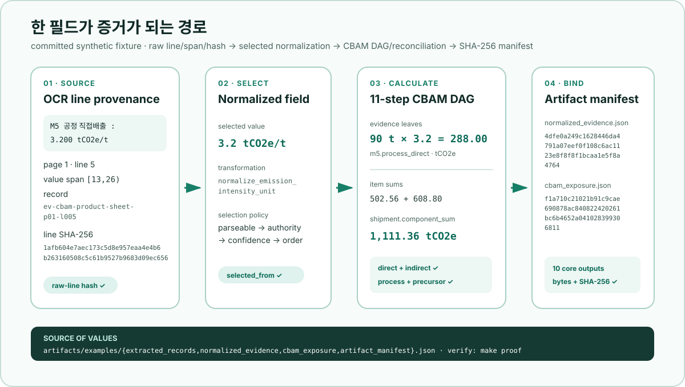

# EcoGuard

[](https://github.com/soccz/EcoGuard/actions/workflows/verify.yml)
[](https://github.com/soccz/EcoGuard/releases/tag/v0.6.0)
[](https://github.com/soccz/EcoGuard/actions/workflows/codeql.yml)
[](https://github.com/soccz/EcoGuard/actions/workflows/forest-xai.yml)

**비정형 무역자료를 계산 가능한 값으로 바꾸는 것보다, 그 값이 어디에서 왔고 왜 선택됐는지 증명하는 일이 더 어려웠습니다.** EcoGuard는 이 증명 과정을 코드로 재구성한 무역금융 교육용 PoC입니다.

2026 하나 청년 금융인재 양성 프로젝트에서 3인 Team UniHana가 준비·발표해 **대상(상장 표기: 금융감독원상)**을 받았습니다. [연합뉴스 보도](https://www.yna.co.kr/view/AKR20260724041100002)와 [하나금융그룹 제공 보도자료 게재본](https://www.hankyung.com/article/202607243395P)에 따르면 대상 팀에는 상장과 상금 1천만 원이 수여됐습니다. 대상은 세 사람이 함께 만든 팀 성과이며, 수상 결과를 아래 코드의 정확도 증거로 사용하지 않습니다.

## 재현 범위부터 선택하기

| 목적 | 고정할 범위 | 첫 명령 | 포함 관계 |
|---|---|---|---|
| 전체 포트폴리오를 인용·재현 | [**`v0.6.0` tag**](https://github.com/soccz/EcoGuard/releases/tag/v0.6.0) | 아래 [tag quickstart](#한-번에-재현하기), `make proof` | dependency-free core와 별도 `research/forest_xai`가 같은 tag tree에 있음. 연구 의존성·수치·artifact는 core wheel·core test count에서 제외 |
| 역사적 core-only 기준선 확인 | [**`v0.5.0` tag**](https://github.com/soccz/EcoGuard/releases/tag/v0.5.0) | `git clone --branch v0.5.0 --depth 1 …` | Sentinel-2/Grad-CAM과 post-award GAN/2.5D 추가 전 core 릴리스 |
| 릴리스 이후 개발 상태 검토 | **current `main` commit** | commit SHA 고정 후 `make proof` | 다음 변경이 먼저 들어올 수 있으므로 `v0.6.0`과 동일하다고 가정하지 않음 |

동일 결과를 인용하려면 tag를, 최신 포트폴리오를 검토하려면 현재 commit SHA를
함께 고정합니다. 질문별 읽기 경로는 [문서 지도](docs/README.md)에 모았습니다.

## 60초 기술 증거표

`make proof`는 네트워크나 모델 의존성 없이 committed artifact를 읽어 아래 대표값과
SHA-256 연결을 검증합니다. `[PASS]`는 저장소의 제한된 공개 계약을 통과했다는 뜻이며
운영 정확도·법률 적합성·대회 당시 구현을 대신 증명하지 않습니다.

| 기술 주장 | 실행 코드 | 방어 테스트 | 직접 볼 artifact | 검증되는 범위와 경계 |
|---|---|---|---|---|
| OCR output → field provenance | [`ocr_adapter.py`](src/ecoguard/ocr_adapter.py), [`ingestion.py`](src/ecoguard/ingestion.py), [`preprocessing.py`](src/ecoguard/preprocessing.py) | [`test_ocr_adapter.py`](tests/test_ocr_adapter.py), [`test_ingestion.py`](tests/test_ingestion.py), [`test_preprocessing.py`](tests/test_preprocessing.py) | [`extracted_records.json`](artifacts/examples/extracted_records.json) → [`normalized_evidence.json`](artifacts/examples/normalized_evidence.json) | 7문서·37 line·30 candidate, raw line/character span/line·document hash와 `selected_from`; OCR engine 정확도 아님 |
| CBAM 11-step DAG + 양축 대사 | [`cbam.py`](src/ecoguard/cbam.py) | [`test_cbam.py`](tests/test_cbam.py) | [`cbam_exposure.json`](artifacts/examples/cbam_exposure.json), [`artifact_manifest.json`](artifacts/examples/artifact_manifest.json) | 11개 topological step, `direct+indirect`와 `process+precursor`가 모두 1,111.36 tCO2e로 일치; 법정 인증서 의무액 아님 |
| EUR-Lex citation + fail-closed abstention | [`legal.py`](src/ecoguard/legal.py), [`regulatory.py`](src/ecoguard/regulatory.py) | [`test_legal.py`](tests/test_legal.py), [`test_regulatory_coverage.py`](tests/test_regulatory_coverage.py) | [`legal_issue_citations.json`](artifacts/examples/legal_issue_citations.json), [`legal_blind_evaluation.json`](artifacts/benchmarks/legal_blind_evaluation.json) | 공식 CELEX/ELI binding, 12 negative의 기권·false support 0; maintainer-authored holdout이며 외부 blind·법률 자문 아님 |
| 공개 Sentinel-2 + Grad-CAM | [`public_training.py`](research/forest_xai/public_training.py), [`explain.py`](research/forest_xai/explain.py) | [`test_public_demo.py`](research/forest_xai/tests/test_public_demo.py) | [`evaluation.json`](research/forest_xai/artifacts/public_demo/evaluation.json), [`gradcam.png`](research/forest_xai/artifacts/public_demo/explanation/gradcam.png) | 단일시점 forest-cover F1 0.947917·IoU 0.900991과 reference-targeted 민감도; 실제 bi-temporal change·원인 설명 아님 |
| 수상 후 tiny GAN latent | [`reconstruction.py`](research/forest_xai/reconstruction.py) | [`test_reconstruction.py`](research/forest_xai/tests/test_reconstruction.py) | [`latent_interpolation.json`](research/forest_xai/artifacts/public_demo/reconstruction/latent_interpolation.json), [`latent_interpolation.png`](research/forest_xai/artifacts/public_demo/reconstruction/latent_interpolation.png) | 8-frame `z0→z1`, forest-score JVP 0.01209233; 대회 당시 코드·HiGAN·photorealism 증거 아님 |
| 합성 높이 2.5D drape | [`reconstruction.py`](research/forest_xai/reconstruction.py) | [`test_reconstruction.py`](research/forest_xai/tests/test_reconstruction.py) | [`terrain_drape.json`](research/forest_xai/artifacts/public_demo/reconstruction/terrain_drape.json), [`terrain_drape.png`](research/forest_xai/artifacts/public_demo/reconstruction/terrain_drape.png) | bilinear 합성 높이, 1,089 vertex·1,024 face; Sentinel-2에서 얻은 고도나 satellite→3D reconstruction 아님 |

### 실제 한 필드의 end-to-end proof



그림의 line·span·hash·수치와 두 output hash는 committed JSON에서 그대로 가져왔습니다.
검증 구현과 tamper test는 [`scripts/proof_summary.py`](scripts/proof_summary.py)와
[`tests/test_proof_summary.py`](tests/test_proof_summary.py)에서 확인할 수 있습니다.

## 이 저장소의 기술 저자와 공개 범위

저장소 소유자 [**@soccz**](https://github.com/soccz)는 대회에서 **핵심 기술 엔진의 단독 개발 책임자**로 참여해 CBAM 계산·가격 민감도, 산림 변화 분석, 데이터 처리·검증 로직을 설계하고 구현했습니다. 공개 v0.6의 Python 패키지, schema, benchmark, 테스트와 재현 산출물도 이 개발 범위를 제3자가 검증할 수 있도록 @soccz가 정리한 것입니다.

이 문장은 팀 전체 결과를 개인 성과로 바꾸려는 설명이 아닙니다. 대회 수상과 프로젝트 결과는 3인 팀의 공동 성과입니다. 다른 참여자의 세부 역할, 원본 Live Demo와 발표용 웹 구현은 이 기술 저장소의 공개·평가 범위에 넣지 않습니다.

### 대회 당시 기술과 공개 v0.6의 차이

| 시점 | 실제 범위 | 이 저장소와의 관계 |
|---|---|---|
| **2026 대회 당시** | @soccz가 핵심 엔진을 설계·구현하고, 팀이 이를 발표용 서비스 흐름으로 구성해 시연 | 원본 서비스·전체 소스·실데이터·비공개 Demo는 포함하지 않음 |
| **공개 v0.6 core** | OCR engine-output adapter, 정규화와 provenance, Legal retrieval·blind-style holdout, CBAM trace·규칙 coverage, 합성 NDVI·geospatial 평가를 dependency-free Python으로 재구성 | 합성 입력·고정 정책·정량 benchmark·golden artifact로 공개 기술 주장만 재현 |
| **v0.6 선택형 산림 연구 트랙** | 공개 Sentinel-2 단일시점 CNN·Grad-CAM, 합성 전후영상 CNN·JVP, 발표 아이디어의 수상 후 GAN latent·2.5D 재구성을 core 밖에서 검증 | `research/forest_xai` 전용 의존성·테스트·artifact를 사용하며 core wheel 및 core 수치에 포함하지 않음 |

즉, 이 저장소는 대회 당시 운영 백엔드의 그대로인 복원본이 아니라, 당시 @soccz가 담당한 핵심 개발을 **공개 가능한 입력과 더 엄격한 검증 계약으로 재구성한 기술 증거**입니다.

```text
Tesseract TSV / provider-neutral JSON / pdftotext 출력
  → 공통 document bundle + field-level benchmark
7개 합성 문서의 OCR line payload
  → label 추출 + 원문 span/SHA-256
  → 단위·별칭 정규화 + 후보 선택 trace
  → 문서 간 충돌·누락 validation ledger
  → CBAM/EUDR 조문 retrieval + 기권 평가
  → CBAM component 산식 DAG + 가격 민감도
  → NDVI mask + geotransform·cloud/nodata·spatial holdout + GeoJSON
  → 사람이 검토하는 JSON/HTML evidence packet

optional research/forest_xai (core wheel 밖)
  실제 공개 단일시점 Sentinel-2 chip
    → forest-cover CNN → evaluation → Grad-CAM
  합성 before/after 4-band pair
    → change CNN → Grad-CAM + local latent JVP
  수상 후 발표 개념 재구성
    → public-fixture tiny GAN → z0→z1 frames + forest-score JVP
    → synthetic height interpolation + RGB/probability 2.5D drape
```

> Core는 OCR 이미지 인식 모델, 법률 LLM, 법정 CBAM 계산기 또는 운영 위성 모델을 주장하지 않습니다. 선택형 연구 트랙의 실제 위성 축도 **단일시점 산림피복 segmentation**일 뿐 실제 전후시점 산림변화 탐지가 아닙니다. 수상 후 tiny GAN·합성 높이 2.5D 경로는 발표 아이디어의 재구성이지 당시 코드를 복구한 것이 아닙니다. HiGAN, 발표 당시 `83.4% → 96.2%`, photorealism, 위성영상에서 고도·3D를 복원하는 pipeline은 검증됐다고 주장하지 않습니다.

## 자료별 역할과 읽는 순서

| 자료 | 답하는 질문 | 포함한 내용 |
|---|---|---|
| **이 GitHub 저장소** | 기술 주장을 다시 실행하고 검증할 수 있는가? | 합성 입력, Python 패키지, 테스트, schema, golden artifact, 재현 명령 |
| [**상세 프로젝트 보고서**](https://soccz.github.io/projects/ecoguard/) | 어떤 대회를 준비했고, 왜 이 문제로 좁혔으며, 무엇을 배우고 발표했는가? | 수상 기록, CarbonCast→EcoGuard 발전 과정, 현업·법무 피드백, 화면, 회고와 한계 |
| [**공개용 4쪽 case study**](presentation/EcoGuard_Selected_Excerpt.pdf) | 프로젝트의 핵심을 짧게 훑을 수 있는가? | OCR 이후 전처리, 조문 근거, CBAM·산림 기술 경계와 proof journey |

과정과 발표 맥락을 먼저 보려면 상세 보고서부터, 구현 근거를 확인하려면 아래 재현 명령부터 읽으면 됩니다. 원본 Live Demo는 공개하지 않습니다.

## 한 번에 재현하기

Python 3.11 이상과 표준 라이브러리만 있으면 런타임에 네트워크가 필요하지 않습니다.
아래 명령은 검증된 `v0.6.0` 릴리스 태그를 고정합니다. `main`은 다음 변경이
먼저 들어올 수 있는 개발 브랜치이므로 동일 결과를 인용하거나 검증할 때는 태그를
사용합니다.

```bash
git clone --branch v0.6.0 --depth 1 https://github.com/soccz/EcoGuard.git
cd EcoGuard
python3 -m venv .venv
source .venv/bin/activate
python -m pip install -e .
./scripts/reproduce.sh
```

위 예시는 Bash가 있는 POSIX 환경 기준입니다. 다른 환경에서는 마지막 명령 대신
다음 두 명령을 실행할 수 있습니다.

```bash
python -m ecoguard reproduce --output artifacts/generated
python -m ecoguard benchmark --root . --output artifacts/generated-benchmarks
```

더 강한 배포 검증:

```bash
./scripts/verify_release.sh
```

배포 검증 명령은 격리된 임시 환경에 `dev` 도구와 build dependency를 받아
설치합니다. 처음 실행할 때는 네트워크가 필요하지만, 생성된 wheel의 runtime은
저장소 밖에서 네트워크 호출 없이 검증됩니다.

이 명령은 다음을 한 번에 확인합니다.

1. 전체 단위·회귀·통합·Draft 2020-12 schema 테스트
2. Hypothesis 속성 테스트와 branch coverage 85% gate
3. source tree compile + Ruff + Black
4. tracked 수정·non-ignored 미추적 파일이 없는 clean worktree 확인
5. clean HEAD를 Git archive로 두 번 내보내 파일 mode·timestamp까지 정규화
6. commit timestamp를 `SOURCE_DATE_EPOCH`으로 고정해 wheel을 두 번 build하고 SHA-256 일치 확인
7. wheel package resource 8개 allow-list 검사
8. 임시 virtualenv 설치 후 전체 테스트 재실행
9. 저장소 밖의 빈 작업 디렉터리에서 core pipeline 실행
10. core 11개와 benchmark 6개 artifact의 byte-for-byte diff

GitHub Actions에서도 같은 스크립트를 Python 3.11·3.12·3.13·3.14에서 실행합니다. 태그
릴리스는 네 버전의 core 검증과 Python 3.12 CPU 산림 연구 재학습이 모두 성공한 뒤에만
생성됩니다. Release에는 wheel·PDF와
`SHA256SUMS.txt`를 함께 싣고, GitHub artifact attestation으로 두 배포 자산의 build
provenance를 서명합니다. 내려받은 wheel은 `gh attestation verify <wheel> -R
soccz/EcoGuard`로 확인할 수 있습니다.

`make proof`는 committed artifact만 읽는 빠른 offline 검증입니다.
`make test`, `make reproduce`, `make verify`는 core의 실행·배포 검증 진입점을
제공합니다.
`make test`를 현재 환경에서 직접 실행하려면 먼저 개발 extra를 설치합니다.

```bash
python -m pip install -e '.[dev]'
```

`make verify`는 격리된 임시
환경에 고정된 개발 의존성을 스스로 설치합니다.

고정 `v0.6.0` tag의 core release suite에는 **180개 test method**가 있으며 이 수치는
`tests/`와 dependency-free wheel의 계약만 가리킵니다. 선택형 산림 연구 트랙의
23개 PyTorch 연구 테스트, 모델 metric과 artifact는 core 숫자에 더하지 않습니다.
위 `v0.6.0` tag tree의 `research/forest_xai`는 아래 명령처럼 별도 환경에서
실행합니다.

```bash
python -m pip install \
  --index-url https://download.pytorch.org/whl/cpu \
  "torch==2.13.0"
python -m pip install -r research/forest_xai/requirements.txt
python -m unittest discover -s research/forest_xai/tests -v
python -m research.forest_xai.scripts.verify_public_demo
python -m research.forest_xai.scripts.verify_reconstruction
```

두 verifier는 학습을 다시 하지 않고 committed fixture·checkpoint·artifact hash를
검사한 뒤 public 추론·Grad-CAM과 reconstruction 산출물을 다시 만듭니다. Public
artifact hash와 immutable metadata, 정수 mesh face는 exact하게 대조합니다. Fast
reconstruction replay의 probability curve는 절대오차 `5e-4`, JVP path
length·derivative는 `1e-4`, 2.5D float array는 `1e-6`, latent contact sheet는
decode한 RGB channel 오차를 최대 2/255로 제한합니다.
CPU 재학습까지 반복하려면 해당 verifier에 `--retrain`을 붙입니다.
Public CNN은 80 epoch, tiny GAN은 120 epoch를 반복합니다. 자세한 설치·실행 경계는
[`research/forest_xai/README.md`](research/forest_xai/README.md)에 있습니다.
재학습 full audit의 기준 환경은 CI와 같은 Ubuntu x86_64·CPython 3.12·
`torch 2.13.0+cpu`입니다. 같은 계약 안에서도 CPU kernel에 따른 마지막 반올림은
가중치 절대오차 `5e-4`, 최종 loss `1e-3`, 확률 곡선 `5e-4`, JVP `1e-4`로
제한하고 immutable metadata는 exact하게 비교합니다. 다른 플랫폼·PyTorch
build에서는 fast verifier를 실행할 수 있지만 이 full-audit tolerance를 보장하지
않습니다.

## 현재 core가 실제로 검증하는 것

| 단계 | 공개 입력 | 결정론적 출력과 검증 | 경계 |
|---|---|---|---|
| OCR adapter benchmark | 합성 Tesseract TSV + field reference | TSV/generic JSON/pdftotext → 공통 bundle, field P/R/F1와 mismatch/missing/spurious | OCR engine 자체 성능이 아니라 adapter·평가 경로 회귀셋 |
| Document ingestion | 7개 문서, 37개 OCR line | 30개 후보, document/page/line/character span, line·document SHA-256 | 실제 기업 문서 정확도는 평가하지 않음 |
| Preprocessing | 후보값 + 선택 정책 | 26개 정규 필드, kg→t, 별칭, 문서 권위, 후보 순위, 검증 이슈 3건(high 1·review 2), tolerance observation 1건 | 운영 정책이나 자동 승인 기준이 아님 |
| Legal retrieval | 조문 8건 + 개발 34건 + 별도 blind-style 36건 | official identifier binding, BM25F trace, instrument/intent gate, abstention, holdout threshold report | maintainer 작성 post-hoc holdout이며 외부 blind 검증·LLM 생성·법률 자문이 아님 |
| CBAM | 품목별 공정/전구물질 × 직접/간접 구성요소 + 공식 EUR-Lex 규칙 coverage map | 11-step DAG, leaf provenance, 양방향 대사, 3개 가격 민감도; 선정 규칙 15개 중 partial 8·미구현 7 | 구현 완료 statutory pathway 0개, 법정 인증서 의무액이 아님 |
| Forest | 6×6 NDVI 회귀셋 + 4×6 geospatial benchmark | reference metrics, affine area, EPSG contract, cloud/nodata, acquisition·seasonality, deterministic tile holdout, native-CRS GeoJSON | 실제 Sentinel/Landsat·CNN 정확도·EUDR 판정이 아님 |
| Evidence packet | 모든 중간 산출물 | JSON/HTML 보고서 + 입력/출력 SHA-256 manifest | 사람이 최종 검토함 |
| Integration API | normalized evidence 또는 legal query | loopback WSGI health/CBAM/legal JSON boundary | 인증 없는 로컬 예제; 운영 배포 금지 |

고정 회귀 fixture의 대표 결과:

```text
Ingestion         7 documents · 37 lines · 30 candidates
Normalization     26 fields · 3 issues (high 1 + review 2) · 1 tolerance observation
Legal eval        16 positive + 8 distractor + 10 hard-negative
                   Recall@3 1.0 · MRR 1.0 · negative abstention 1.0
                   false support 0.0 · instrument leakage 0.0
CBAM inventory    direct 970.50 + indirect 140.86 = 1,111.36 tCO2e
                   process 731.36 + precursor 380.00 = 1,111.36 tCO2e
Forest reference  TP 11 · FP 1 · FN 1 · TN 23
                   F1 0.916667 · IoU 0.846154
OCR adapter       TP 2 · FP 2 · FN 2 · mismatch/missing/spurious each 1
                   P/R/F1 0.5 (intentional error fixture, not OCR accuracy)
Legal holdout     16 positive + 8 distractor + 12 negative
                   Recall@3/MRR/negative abstention 1.0 (maintainer-authored)
Geospatial holdout valid 9 pixels · TP 4 · FP 1 · FN 1 · TN 3
                   F1 0.8 · masked 4/24 (synthetic plumbing only)
CBAM coverage     15 selected rules · partial 8 · not implemented 7 · complete 0
```

Legal의 1.0은 의도적으로 고정한 작은 회귀셋이 기대 citation을 회수한다는 뜻입니다. 일반 EU 법률 검색 성능으로 해석하지 않습니다. Forest 지표도 실제 영상 성능이 아니라 metric code가 오탐·미탐을 드러내는지 확인하는 합성 reference 결과입니다.

각 수치가 어느 입력·함수·테스트·산출물로 검증되는지는 [주장-증거 검증표](docs/VALIDATION.md)에서 바로 대조할 수 있습니다.

### 선택형 산림 연구 트랙은 무엇을 더 증명하는가

이 트랙은 core의 합성 geospatial benchmark를 실제 위성 정확도로 바꾸지 않습니다.
서로 다른 두 실험을 나란히 두되 입력과 주장을 섞지 않는 것이 목적입니다.

| 연구 축 | 입력·분할 | 공개 구현과 고정 결과 | 주장하지 않는 것 |
|---|---|---|---|
| 실제 단일시점 산림피복 | CC BY 4.0 Sentinel-2 L2A B4/B3/B2/B8 derivative; train 24 chip·2 scene / evaluation 12 chip·2 scene, scene overlap 0 | `TinyForestCoverSegmenter`, checkpoint+sidecar, CPU 재평가, forest F1 0.947917·IoU 0.900991, reference-targeted Grad-CAM | 전후 변화, 산림훼손 원인·합법성, 외부 독립 benchmark, 현장 일반화 |
| 합성 전후영상 smoke test | 프로그램으로 만든 before/after 4-band pair와 change mask | 작은 change CNN의 train/evaluate/explain, segmentation Grad-CAM, local classifier-score JVP, checkpoint tamper guard | 실제 위성 metric, GAN·HiGAN, 인과 counterfactual, semantic latent factor |
| 발표 개념의 수상 후 재구성 | 공개 train chip으로 새로 학습한 tiny GAN, 결정론적 latent endpoint, 공개 evaluation RGB·산림 확률, 합성 높이장 | `z0 → z1` 8-frame contact sheet·forest-score JVP, hash-pinned checkpoint, x/y 격자의 bilinear height interpolation·2.5D drape | 대회 당시 코드, 특정 HiGAN, photorealism, 발표 수치, 실제 위성 고도·3D |

아래는 evaluation sample `S2-EV-003`의 공개 artifact입니다. Grad-CAM은
모델 민감도를 보여 줄 뿐, 분류 근거의 인과성이나 생태학적 타당성을
증명하지 않습니다.

<table>
  <tr>
    <th>Sentinel-2 RGB</th>
    <th>Forest probability</th>
    <th>Reference-targeted Grad-CAM</th>
  </tr>
  <tr>
    <td></td>
    <td></td>
    <td></td>
  </tr>
</table>

발표 당시에는 GAN latent 보간과 z축/현장형 표현을 시도했지만, 전수조사에서
당시 GAN 코드·notebook·checkpoint는 발견되지 않았습니다. 아래 artifact는 그
사실을 소급해 꾸미는 대신, 공개 입력과 machine-readable 경계로 핵심 연산을
수상 후 새로 구현한 결과입니다.

| Tiny-GAN latent interpolation | Synthetic-height 2.5D drape |
|---|---|
|  |  |

구조·checkpoint·JVP·2.5D 경계는
[`RECONSTRUCTION_CARD.md`](research/forest_xai/RECONSTRUCTION_CARD.md)에
고정했습니다. 이는 HiGAN 재현이나 실사 생성 품질의 증거가 아닙니다.

F1 0.947917·IoU 0.900991은 네 개의 maintainer-selected source scene에서
만든 작은 forest/non-forest **capability fixture**의 결과입니다. 발표 수치,
실제 산림변화 정확도, 외부 독립 평가와 비교할 수 없습니다. 데이터
출처·derivative·split은 [`DATA_CARD.md`](research/forest_xai/DATA_CARD.md), 모델
구조·metric·위험은 [`MODEL_CARD.md`](research/forest_xai/MODEL_CARD.md), 전체
실행 순서는 [`research/forest_xai/README.md`](research/forest_xai/README.md)에 고정했습니다.

## 1. OCR 이후의 데이터 전처리

현업 자료는 완성된 표보다 자유로운 메모, 서로 다른 단위, 약칭, 빈칸에 가깝다는 피드백에서 출발했습니다. 합성 fixture에는 다음과 같은 line이 함께 들어 있습니다.

### OCR 결과를 실제 입력 경계로 바꾸기

`ocr_adapter.py`는 Tesseract-compatible TSV, provider-neutral JSON, `pdftotext` plain text를 `ocr-document-bundle/1.0`으로 변환합니다. 좌표·confidence·중복·NaN을 fail-closed로 검사하며, 정답 field와 비교해 precision/recall/F1 및 value mismatch·missing·spurious를 분리합니다.

```bash
PYTHONPATH=src python3 scripts/benchmark_ocr.py
```

기본 합성 fixture는 일부러 오인식·누락·가짜 field를 넣어 P/R/F1 0.5가 나오게 했습니다. 높은 숫자를 홍보하는 평가가 아니라 **오류가 어느 층에서 생겼는지 재현하는 테스트**입니다. [입력 계약과 로컬 OCR 연결법](docs/OCR_BENCHMARK.md)을 별도로 문서화했습니다.

```text
총 출하 중량 : 190,000 kg
NET WT | 190 MT
출하량 = 약 191톤? 최종 인보이스 재확인 필요
배출계수 : 5.85 tCO2/t 정도, 아직 검증 전
검증서 번호 : [blank]
배출계수 : 배분근거 미첨부
```

`ingestion.py`는 label 뒤의 후보를 추출하면서 원문 span과 hash를 보존합니다. `preprocessing.py`는 `normalization_policy.json`에 따라 다음 순서로 후보를 선택합니다.

```text
parse 가능 여부 > 문서 권위 > confidence > 안정적인 입력 순서
```

- Invoice의 190t와 Packing list의 190t는 단위가 달라도 같은 값으로 정규화합니다.
- Operator memo의 191t는 낮은 권위라도 삭제하지 않고 material conflict로 남깁니다.
- 5.849263과 5.85는 설정된 `0.001` 허용오차 안의 rounding variance로 구분합니다.
- “배출계수 : 배분근거 미첨부”처럼 label은 있으나 숫자가 없는 line은 parse failure로 남깁니다. 문장 중간의 우연한 alias와 한 line의 복수 label은 추측하지 않고 unmatched evidence로 격리합니다.
- 비어 있는 검증서 번호는 high-severity review 항목이 됩니다.

선택값뿐 아니라 모든 후보, 선택 순위, 변환 종류, 원문 위치가 `normalized_evidence.json`에 남습니다.

## 2. 조문 retrieval을 어떻게 테스트했는가

법률 자료를 RAG에 넣었을 때 중요한 것은 자연스러운 답변뿐 아니라 관련 조문을 실제로 찾았는지 검증하는 일이라는 현업 의견을 받았습니다. 공개본은 생성 모델 대신 **RAG의 retrieval 단계만 분리한 dependency-free 기준선**을 제공합니다.

- regulation/article/title/keyword/concept/팀 작성 요약을 분리한 field-weighted BM25F
- 한국어 word token과 낮은 가중치의 2·3-character n-gram
- CBAM/EUDR 명시 시 다른 규정 후보를 제외하는 instrument filter
- instrument, legal intent, specific concept가 부족하면 기권
- 점수가 낮거나 순위 차이가 작으면 `abstained` 또는 `review`
- 결과마다 citation, CELEX, Article/paragraph metadata, EUR-Lex URL, corpus entry hash
- BM25 word/character, phrase, article bonus와 field별 score trace

평가셋은 positive 16건, hard-negative 10건, 인접 조문 distractor 8건입니다. `CBAM` 단독, 공동인증서, 일반 지도 표시, 농장 체험처럼 법률 질문으로 뒷받침되지 않는 질의는 기권하는지 함께 테스트합니다.

개발 평가와 별개로 36건의 **maintainer-authored post-hoc blind-style holdout**도 분리했습니다. 개발 query 재사용과 긴 corpus 문구 복사를 검사하고, positive 16·distractor 8·negative 12의 threshold 결과를 별도 artifact로 고정합니다. 외부 평가자가 봉인한 blind test나 일반 법률 검색 성능으로 부르지 않습니다.

```bash
ecoguard legal-search \
  "실제 배출량을 쓰려는데 검증서가 없으면 어떤 조항을 확인해야 하나"

ecoguard legal-search "농장 좌표를 지도에 표시하는 방법"
```

두 번째 명령은 관련 단어가 있어도 법률 의도가 부족하므로 citation을 억지로 만들지 않습니다.

## 3. CBAM component trace

기존 발표 수치처럼 이미 완성된 SEE를 곱하는 데서 멈추지 않고, 합성 M5·M12 품목의 구성요소를 다시 합산합니다.

```text
품목 기술 인벤토리 =
  공정 직접배출 + 공정 간접배출
  + 전구물질 직접배출 + 전구물질 간접배출

가격 민감도 =
  기술 인벤토리
  × 시나리오 노출계수
  × max(인증서 가격 − 제3국 탄소가격, 0)
```

각 산식 노드에는 `step_id`, 정확한 피연산자, 단위, 반올림 전 결과가 있습니다. 원문 입력 leaf는 evidence ID를, 중간값은 `derived_from` step ID를, 분석자 민감도 입력은 assumption ID를 가집니다. 다음 두 축이 같은 `1,111.36 tCO2e`로 대사됩니다.

```text
direct 970.50 + indirect 140.86
process 731.36 + precursor 380.00
```

전기 970,000kWh와 LNG 39,300Nm³도 원문 증거로 보존하지만, 배출계수와 공정 배분근거가 없으므로 임의로 CO₂e로 변환하지 않습니다. 결과는 `statutory_calculator: false`이며 공식 CBAM factor, 무상할당 조정, Article 9 적격성, 인증서 의무량을 구현하지 않습니다.

[`cbam_rule_coverage.json`](data/reference/cbam_rule_coverage.json)은 2026-08-12에 확인한 EUR-Lex 기본·시행 규칙 중 15개 요구사항을 코드와 대조합니다. 결과는 **partial 8, not implemented 7, implemented 0**입니다. 계산을 더 완성된 것처럼 보이게 하지 않고, 상품·원산지 scope, 공인 검증, 공식 인증서 가격, 무상할당 조정, 신고·납부 절차 등 빠진 법정 입력과 로직을 기계가 읽을 수 있게 공개합니다.

## 4. 산림 변화 평가 코드

대회 당시 산림 화면의 모델 가중치·평가 데이터는 공개 성과로 재현할 수 없었습니다. 따라서 정확도 수치를 옮겨 적지 않고, 공개 가능한 합성 band와 독립 reference mask로 평가 경로를 새로 만들었습니다.

```text
NDVI = (NIR − Red) / (NIR + Red)
loss = NDVI_before ≥ 0.45 and ΔNDVI ≤ −0.25
```

- 원정밀도 `Decimal`로 threshold를 판정하고 직렬화할 때만 반올림
- 전체 6×6 좌표, reflectance 범위, duplicate/missing cell 검증
- 4/8방향 connected components
- zero denominator metric은 임의의 0이나 1 대신 `null`
- TP/FP/FN/TN SVG와 RFC 7946 형태의 36-cell GeoJSON
- CSV 행 순서를 뒤집어도 결과가 동일한 회귀 테스트

### 지리공간 입력 plumbing

추가 4×6 합성 benchmark는 단순 배열을 실제 raster 계약처럼 다룰 때 필요한 경계를 검사합니다.

- EPSG:32652와 6계수 affine transform, 10m pixel·100m² 면적
- before/after acquisition time, 동일 season과 날짜 차이 정책
- nodata·cloud·shadow를 NDVI와 평가 전에 제외
- clipped row-major tiling과 tile 단위 train/holdout 분리
- valid holdout 9 pixel만으로 TP=4·FP=1·FN=1·TN=3 계산
- native projected polygon을 유지하고 `rfc7946_wgs84: false` 명시

```bash
python -m ecoguard.geospatial \
  data/benchmarks/forest/synthetic_geospatial_case.json \
  --summary /tmp/forest-summary.json \
  --geojson /tmp/forest-cells.geojson
```

[산림 benchmark 문서](docs/FOREST_BENCHMARK.md)는 core 입력과 선택형 연구 입력을
따로 설명합니다. Core는 Sentinel-2·Landsat 공식 STAC/terms를 opt-in
metadata로만 연결하고 영상·credential을 내려받지 않습니다. 선택형 연구는
출처와 CC BY 4.0을 고정한 소형 `.npy` derivative를 commit하지만, raw
scene 다운로드·reprojection·co-registration adapter는 제공하지 않습니다.

## 5. 속성 테스트·로컬 API·공급망 경계

- Hypothesis가 지원 단위의 동등 표기, 명시적 범위·복합단위 거절, provenance 없는 산식 변조 거절, 모든 binary mask의 confusion partition을 반복 생성합니다.
- source branch coverage 전체 85% 이상을 release gate로 강제합니다.
- `ecoguard-api`는 `/health`, `/v1/cbam/calculate`, `/v1/legal/retrieve`만 제공하는 표준 라이브러리 WSGI 예제입니다. 1MB body·8,000자 query cap, UTF-8·중복-key 거절 strict JSON, fail-closed evidence 검증, `human_review_required`를 고정합니다.
- 두 clean Git archive에서 만든 wheel byte가 같아야 하며 CodeQL, Dependabot, CODEOWNERS, security policy를 함께 둡니다.

```bash
ecoguard-api --host 127.0.0.1 --port 8765
curl http://127.0.0.1:8765/health
```

인증·저장소·TLS가 없는 로컬 통합 예제이므로 외부에 공개해서는 안 됩니다. 운영에 필요한 OIDC/mTLS, 문서 저장·보존, 법령 갱신, idempotency, audit log, monitoring은 [운영 경계](docs/OPERATIONS.md)에 분리했습니다.

## 단계를 따로 실행하기

전체 pipeline과 같은 중간 경계를 CLI로 직접 확인할 수 있습니다.

```bash
ecoguard extract data/synthetic/trade_case_documents.json \
  --output /tmp/extracted.json

ecoguard normalize /tmp/extracted.json \
  --policy data/reference/normalization_policy.json \
  --output /tmp/normalized.json

ecoguard cbam-calculate /tmp/normalized.json \
  --output /tmp/cbam.json

ecoguard forest-analyze data/synthetic/forest_case.json \
  --geojson --output /tmp/forest.geojson

ecoguard benchmark --root . --output artifacts/generated-benchmarks
```

## 생성되는 증거 패킷

```text
artifacts/generated/
├── extracted_records.json
├── normalized_evidence.json
├── legal_retrieval_evaluation.json
├── legal_issue_citations.json
├── cbam_exposure.json
├── forest_change.json
├── forest_change.geojson
├── forest_change.svg
├── ecoguard_evidence_report.json
├── ecoguard_evidence_report.html
└── artifact_manifest.json
```

`artifact_manifest.json`에는 8개 입력과 나머지 10개 산출물의 byte 수·SHA-256이 기록됩니다. timestamp와 절대경로는 golden output에 넣지 않습니다.

별도 `artifacts/benchmarks/`에는 OCR field 평가, geospatial summary/GeoJSON, legal blind-style 평가, CBAM 규칙 coverage와 10개 입력·5개 출력 SHA-256 manifest가 있습니다. 두 묶음 모두 release verifier가 committed golden과 byte 단위로 비교합니다.

## 저장소 구조

```text
src/ecoguard/
├── ocr_adapter.py     # OCR engine output → common document bundle + field metrics
├── ingestion.py       # document line → field candidate + source span/hash
├── preprocessing.py   # normalization, selection policy, validation ledger
├── legal.py           # BM25F retrieval, abstention and evaluation
├── regulatory.py      # legal holdout and official-rule coverage validation
├── cbam.py            # component DAG, reconciliation and sensitivity
├── forest.py          # NDVI prediction, reference metrics, GeoJSON/SVG
├── geospatial.py      # CRS/affine/mask/time/tile/holdout benchmark
├── api.py             # local-only WSGI integration example
├── jsonio.py          # duplicate-key/non-finite rejecting UTF-8 JSON boundary
├── benchmark.py       # benchmark orchestration and hash manifest
├── pipeline.py        # deterministic orchestration and manifests
└── report.py          # human-review JSON/HTML packet

data/
├── synthetic/         # trade documents, band grid, reference mask
├── benchmarks/        # OCR, geospatial and legal holdout fixtures
└── reference/         # normalization/legal/CBAM coverage + competition attestation

tests/                 # unit, adversarial, determinism, CLI and integration tests
schemas/               # machine-readable public input contract
artifacts/examples/    # committed byte-stable golden outputs
artifacts/benchmarks/  # committed benchmark evidence and manifest
docs/                  # methodology, architecture, journey and limitations

research/forest_xai/   # optional PyTorch track; core wheel 밖
├── data/public_fixture/       # attributed 24 train + 12 evaluation chips
├── artifacts/public_demo/     # CNN·Grad-CAM + post-award reconstruction evidence
└── tests/                     # separately counted research-only tests
```

## 구현·시뮬레이션·제안 경계

| 상태 | 범위 |
|---|---|
| Core: implemented and tested | OCR output adapters/field evaluation, preprocessing/lineage, BM25F retrieval/holdout, component CBAM sensitivity and coverage map, synthetic NDVI/geospatial evaluation, local API, reports/manifests |
| Optional research: implemented and separately tested | 공개 Sentinel-2 derivative의 단일시점 forest-cover CNN·evaluation·Grad-CAM; 수상 후 tiny-GAN latent interpolation·forest-score JVP; 합성 높이 2.5D drape |
| Simulated with synthetic inputs | OCR engine output, document confidence, 기업·거래·설비, 가격·집약도, raster CRS/time/QA, band/reference mask, before/after change CNN·local latent JVP |
| Not implemented / proposed | OCR vision model, LLM answer generation, 전체 EU 법령 corpus, Hana 내부 연동, 법정 CBAM 의무 계산, 실제 bi-temporal 산림변화, HiGAN 재현, `83.4% → 96.2%` 재현, photorealistic GAN 검증, satellite-derived elevation/3D pipeline, 자동 금융 승인 |

## 프로젝트 과정과 공개 자료

- [질문별 5분 문서 지도](docs/README.md)
- [상세 프로젝트 보고서: 대회 준비·발표·회고](https://soccz.github.io/projects/ecoguard/)
- [개발 과정: 기술보다 증명이 더 어려웠다](docs/DEVELOPMENT_JOURNEY.md)
- [재현 방법론](docs/METHODOLOGY.md)
- [기술 구조](docs/ARCHITECTURE.md)
- [한계와 다음 검증](docs/LIMITATIONS.md)
- [주장-입력-코드-테스트-산출물 검증표](docs/VALIDATION.md)
- [OCR adapter와 field benchmark](docs/OCR_BENCHMARK.md)
- [Legal blind-style 평가 경계](docs/LEGAL_BLIND_EVAL.md)
- [CBAM 공식 규칙 coverage 경계](docs/CBAM_COVERAGE.md)
- [산림 geospatial benchmark](docs/FOREST_BENCHMARK.md)
- [선택형 Forest XAI 실행 가이드](research/forest_xai/README.md)
- [공개 Sentinel-2 derivative 데이터 카드](research/forest_xai/DATA_CARD.md)
- [단일시점 forest-cover CNN 모델 카드](research/forest_xai/MODEL_CARD.md)
- [GAN latent·2.5D 수상 후 재구성 카드](research/forest_xai/RECONSTRUCTION_CARD.md)
- [대회 보관 자료와 공개 재구성의 provenance](docs/COMPETITION_PROVENANCE.md)
- [로컬 API와 운영 전 필수 경계](docs/OPERATIONS.md)
- [변경 기록](CHANGELOG.md) · [기여 규칙](CONTRIBUTING.md) · [보안 정책](SECURITY.md)
- [공식 법령 출처와 버전](data/reference/README.md)
- [공개용 4쪽 프로젝트 case study](presentation/EcoGuard_Selected_Excerpt.pdf)
- [생성된 evidence report 예시](artifacts/examples/ecoguard_evidence_report.html)

원본 Live Demo 주소와 대회 전체 발표자료는 공개하지 않습니다. Core의 사례
데이터는 합성입니다. 유일한 공개 위성 예외인 선택형 연구 derivative의 출처·라이선스는
data card에 구분해 기록했습니다. EcoGuard는 하나은행의 공식 제품이 아니고
법률·통관·금융 자문을 제공하지 않습니다.

## License

코드는 [MIT License](LICENSE)로 배포합니다. EU 법령의 법적 효력은 EUR-Lex 공식 원문을 기준으로 하며 저장소의 한국어 요약은 retrieval 실험용 비공식 메타데이터입니다.
