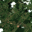
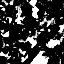
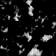
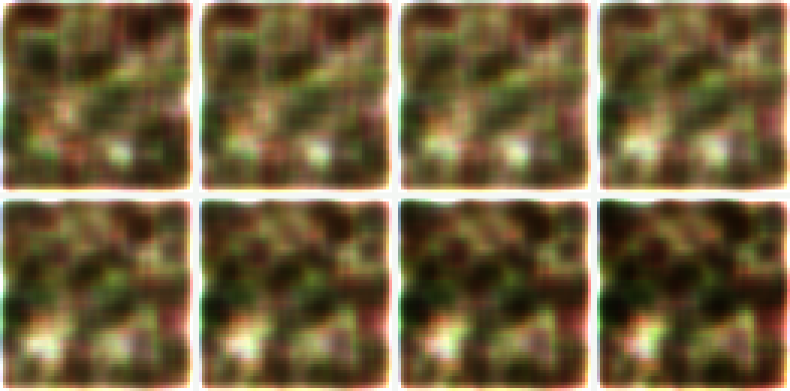
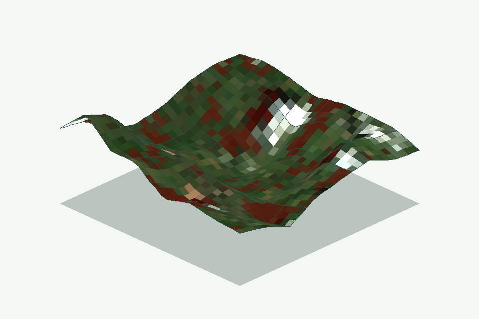

# Forest XAI optional research track

This directory is deliberately separate from the dependency-free `ecoguard`
runtime and wheel. It contains three research tracks whose inputs, tasks, metrics,
and claims must remain separate:

1. **Public single-date forest cover:** an attributed CC BY 4.0 Sentinel-2
   derivative, compact CNN, checkpoint, evaluation, and Grad-CAM artifacts.
2. **Synthetic bi-temporal mechanics:** a before/after four-band change CNN plus
   local classifier-score JVP through a small encoder/generator latent space.
3. **Post-award concept reconstruction:** a tiny GAN trained on the public
   fixture, deterministic latent interpolation with a forest-score JVP, and a
   2.5D drape over a synthetic height field.

The public path is four-band image → forest/non-forest mask. It is not
before/after change detection. See [DATA_CARD.md](DATA_CARD.md) for source and
derivation details and [MODEL_CARD.md](MODEL_CARD.md) for the model's intended
use, evaluation boundary, and risks.

## Claim boundary

The public evaluation F1 `0.947917` is limited to 12 maintainer-selected chips
from two evaluation scenes, separate from two training scenes. It is a small,
non-independent **forest-cover capability fixture**. It is not field validation,
change-detection or deforestation performance, and it must not be compared with
presentation-era figures.

Everything generated by the synthetic commands is a **synthetic smoke test**.
The tiny fixture contains programmatically drawn rectangles and sensor-like
noise. Its metrics prove that train/infer/evaluate and explanation code paths
run; they are not satellite-accuracy claims.

None of the three tracks determines forest loss, causation, legality, EUDR compliance, or
an operational decision.

The latent module is labeled **local JVP latent explanation**. It computes an
exact Jacobian-vector product for a local direction of the learned synthetic
classifier score and decodes one small step along that direction. It is not a
GAN, not a causal counterfactual, not a semantic factor, and not a reproduction
of a named paper or external “HiGAN/HIGAN” implementation. That distinction is
machine-readable in every explanation JSON.

The third path is deliberately labeled **post-award reconstruction**. The
competition presentation described attempts at GAN latent interpolation and a
z/field visualization, but no competition-era GAN code, notebook, checkpoint,
or reproducible generated artifact was found in the repository-wide audit. The
current tiny GAN and relief code were written afterward to make those mechanics
inspectable. They do not establish that this implementation existed during the
competition. See [RECONSTRUCTION_CARD.md](RECONSTRUCTION_CARD.md).

## Environment

Use a separate environment; these dependencies are not installed by the core
package:

```bash
python3 -m venv .venv-forest-xai
. .venv-forest-xai/bin/activate
python -m pip install \
  --index-url https://download.pytorch.org/whl/cpu \
  "torch==2.13.0"
python -m pip install -r research/forest_xai/requirements.txt
```

This is the reference full-audit environment used by CI: Ubuntu x86_64,
CPython 3.12, and `torch 2.13.0+cpu`. `requirements.txt` pins the remaining
versions and repeats the Torch version constraint. Compatible platforms can run
the fast hash/inference verifiers, but `--retrain` intentionally requires exact
version metadata. Even in the reference environment, CPU kernels may differ in
their final floating-point rounding. The public CNN audit keeps immutable
metadata, threshold, and positive/negative pixel populations exact; it bounds
parameter and probability-map replay at `5e-4`, loss and floating metrics at
`5e-5`, and each confusion count at one pixel. The GAN audit bounds parameter replay at
`5e-4`, final losses at `1e-3`, the probability curve at `5e-4`, the JVP at
`1e-4`, and decoded preview channels at 2/255. It does not promise tensor/byte
equality across operating systems, accelerators, or PyTorch builds.

## Verify the committed public forest-cover demo

The fast verifier reloads all committed NPY arrays through the strict loader,
checks file hashes, shapes, ranges and scene separation, loads the checkpoint
with `weights_only=True` only after its file SHA-256 matches the committed
sidecar, reproduces `evaluation.json`, regenerates the four explanation
images, and compares every declared SHA-256. The checkpoint-loading path is
hardened for this committed, hash-pinned artifact only; it is not a safe
loader for arbitrary external checkpoints:

```bash
python research/forest_xai/scripts/verify_public_demo.py
```

### Committed public-data trace

| Sentinel-2 RGB preview | Forest probability | Grad-CAM sensitivity |
|---|---|---|
|  |  |  |

The source reference mask and every image hash are recorded in
[`explanation.json`](artifacts/public_demo/explanation/explanation.json). The
Grad-CAM panel is a model-sensitivity trace for one labeled evaluation sample,
not evidence of forest change or causal attribution.

The same public commands can be run separately:

```bash
python -m research.forest_xai public-evaluate \
  --device cpu \
  --fixture-root research/forest_xai/data/public_fixture \
  --checkpoint research/forest_xai/artifacts/public_demo/sentinel2_forest_cover.pt \
  --output research/forest_xai/_runs/public-check/evaluation.json

python -m research.forest_xai public-explain \
  --device cpu \
  --fixture-root research/forest_xai/data/public_fixture \
  --checkpoint research/forest_xai/artifacts/public_demo/sentinel2_forest_cover.pt \
  --sample-index 3 \
  --output-dir research/forest_xai/_runs/public-check/explanation
```

Normal tests do not repeat the 80-epoch training. Run the explicit CPU audit when
you need to prove that training returns the same immutable metadata, threshold,
and evaluation populations, with parameters/probability maps within `5e-4`,
loss/floating metrics within `5e-5`, and confusion counts within one pixel:

```bash
python research/forest_xai/scripts/verify_public_demo.py --retrain
```

Use `--retrain-output <new-or-empty-directory>` with `--retrain` to retain that
run instead of using a temporary directory.

PyTorch checkpoint container bytes and tensor-state SHA-256 may differ when CPU
kernels round the final parameter bits differently. Each checkpoint and tensor
state remains exactly hash-bound to its own sidecar; the cross-CPU retraining
audit compares immutable metadata, threshold, and evaluation populations exactly
and applies the documented narrow bounds to raw parameters and derived numeric
semantics.

## Verify the post-award reconstruction

The reconstruction verifier validates the committed tiny-GAN checkpoint and
metadata before `weights_only=True` loading, reproduces the deterministic
8-frame latent contact sheet, forest-probability curve and exact JVP, and
regenerates the 2.5D drape, height/probability arrays,
1,089-vertex/1,024-face mesh and its machine-readable claim boundary. The
committed PNG hash remains exact; replay compares decoded RGB pixels with a
maximum 2/255 per-channel tolerance because CPU kernels can change a preview's
rounding or compression bytes without changing the recorded probabilities or
JVP. Committed NPY hashes also remain exact; regenerated float arrays use a
1e-6 absolute tolerance and integer face indices must match exactly:

```bash
python -m research.forest_xai.scripts.verify_reconstruction
```

Repeat the CPU GAN training and compare invariant metadata exactly, parameters
within `5e-4`, final losses within `1e-3`, the probability curve within `5e-4`,
the JVP within `1e-4`, and the bounded decoded preview only when a full audit is
needed:

```bash
python -m research.forest_xai.scripts.verify_reconstruction --retrain
```

The equivalent individual commands are:

```bash
python -m research.forest_xai recon-train \
  --fixture-root research/forest_xai/data/public_fixture \
  --output-dir research/forest_xai/_runs/reconstruction \
  --seed 20260812 --device cpu --epochs 120

python -m research.forest_xai recon-interpolate \
  --gan-checkpoint research/forest_xai/_runs/reconstruction/latent_gan.pt \
  --classifier-checkpoint research/forest_xai/artifacts/public_demo/sentinel2_forest_cover.pt \
  --output-dir research/forest_xai/_runs/reconstruction \
  --seed 20260812 --frames 8 --device cpu

python -m research.forest_xai recon-drape \
  --fixture-root research/forest_xai/data/public_fixture \
  --classifier-checkpoint research/forest_xai/artifacts/public_demo/sentinel2_forest_cover.pt \
  --output-dir research/forest_xai/_runs/reconstruction \
  --seed 20260812 --sample-index 3 --device cpu
```

| Latent path | 2.5D drape |
|---|---|
|  |  |

The GAN consumes public-derived training pixels, but it has no FID, external
holdout or photorealism evaluation. The relief uses real fixture RGB and model
probability over a **synthetic** bilinearly interpolated height field. It does
not use a DEM and does not infer elevation or 3D geometry from satellite data.

## Reproduce the synthetic track

From the repository root:

```bash
python -m research.forest_xai train \
  --device cpu \
  --seed 20260812 \
  --epochs 12 \
  --output-dir research/forest_xai/_runs/demo

python -m research.forest_xai evaluate \
  --device cpu \
  --checkpoint research/forest_xai/_runs/demo/forest_xai_checkpoint.pt \
  --output research/forest_xai/_runs/demo/evaluation.json

python -m research.forest_xai explain \
  --device cpu \
  --checkpoint research/forest_xai/_runs/demo/forest_xai_checkpoint.pt \
  --sample-index 1 \
  --direction decrease \
  --output-dir research/forest_xai/_runs/demo/explanation
```

The train command writes:

- the PyTorch checkpoint;
- a JSON metadata sidecar containing seed, architecture, dependency version,
  fixture hashes, deterministic settings, tensor-state SHA-256, and checkpoint
  SHA-256;
- a training result JSON with an explicit synthetic warning.

Evaluate and explain fail closed when the checkpoint bytes do not match the
sidecar. Explain writes a normalized Grad-CAM PNG, raw arrays in NPZ, hashes, and
the JVP score trace.

CPU is the documented reproducibility target. `--device cuda` is explicit and
fails if CUDA is unavailable; `--device auto` is convenient but may not be
byte-identical across hardware.

## Test

```bash
python -m unittest discover -s research/forest_xai/tests -v
ruff check research/forest_xai
black --check research/forest_xai
```

Tests cover fixture stability, tensor shapes and guards, both CNN surfaces,
Grad-CAM bounds, JVP directionality, both checkpoint tamper guards, the synthetic
train → evaluate → explain flow, and committed public fixture/model/artifact
re-verification on CPU. Manifest duplicate keys and sidecar filename mismatch
also fail closed. Reconstruction tests separately cover deterministic GAN
training, safe hash-bound loading, latent/JVP regeneration, synthetic-height
claim boundaries, drape regeneration and tamper rejection. The committed `artifacts/public_demo/` files are an
explicit `.gitignore` allow-list; generated `_runs/` outputs remain ignored.
